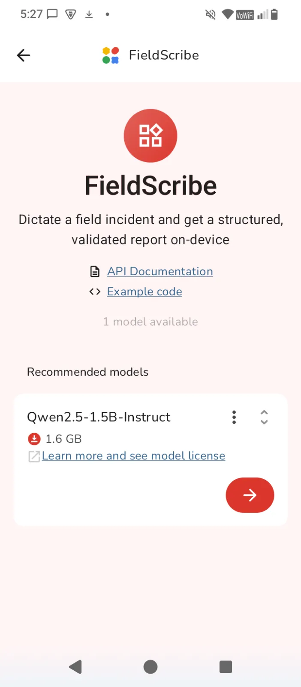
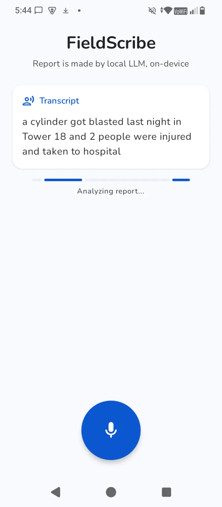
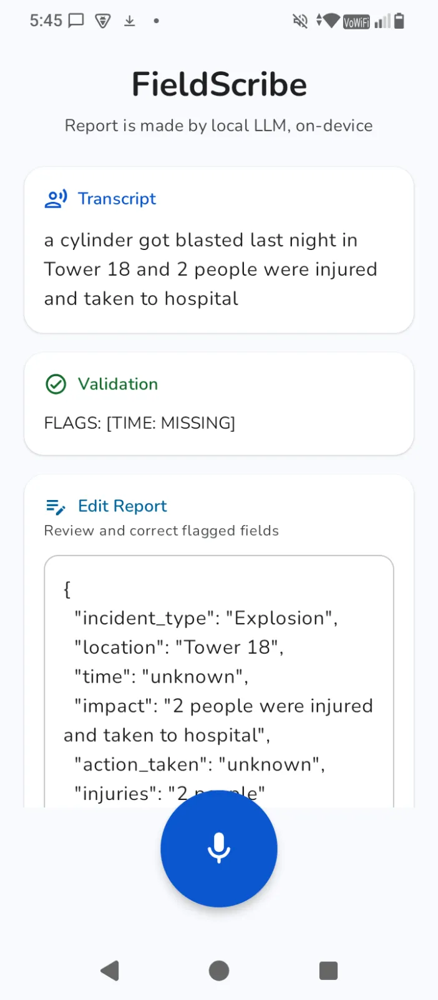

# FieldScribe

**Voice-to-structured incident report — powered by a local LLM running fully offline on-device (Qwen 2.5)**

<p>
  &nbsp;&nbsp;&nbsp;
  &nbsp;&nbsp;&nbsp;
  
</p>

FieldScribe is built on top of [Google AI Edge Gallery](https://github.com/google-ai-edge/gallery). A field worker dictates an incident, and a local LLM (Qwen 2.5 1.5B, quantized to Q4) running entirely on the device transcribes, structures, and validates the report — zero cloud, zero connectivity required.

## How It Works

All inference runs locally via [LiteRT-LM](https://github.com/google-ai-edge/LiteRT-LM). No data ever leaves the device.

1. **Capture** — Worker taps the mic and speaks naturally.
2. **Transcribe** — Android's on-device SpeechRecognizer converts audio to raw text.
3. **Structure** — The local LLM converts the raw transcript into a structured JSON report with fixed fields: `incident_type`, `location`, `time`, `impact`, `action_taken`, `injuries`.
4. **Validate** — A second, separate LLM inference pass reviews the structured report. Incomplete or ambiguous fields are flagged inline so the worker can correct them before finalizing.

## Why Fully Offline

Field workers in utilities, logistics, and disaster relief often operate in areas with no connectivity. FieldScribe ensures reports are generated on-site, in real time, without depending on a server. The only network call is the initial one-time model download.

## Key Design Decisions

- **Local LLM, no cloud** — Both structuring and validation run on Qwen 2.5 1.5B (Q4) via the LiteRT inference pipeline that ships with AI Edge Gallery. The model runs on-device hardware (CPU/GPU), keeping latency low and data private.
- **Two-pass inference with session reset** — `resetConversation()` is called before each `runInference` call. The LiteRT session is stateful; without resetting, the structuring and validation calls would inherit stale context.
- **Strictly sequential chaining** — `generateStructuredReport()` completes first, then `validateReport()` runs on its output. Both reuse the same loaded model instance to keep memory flat.
- **Short, field-constrained prompts** — Small on-device LLMs degrade with verbose prompts. Tightly scoped prompts with an exact field list produce more consistent output.
- **Qwen over Gemma** — Switched to Qwen 2.5 to avoid HuggingFace OAuth requirements, keeping the offline-first flow frictionless.

## Build & Run

Requires Android 12+ and a physical device (not emulator).

```bash
cd Android/src
./gradlew assembleDebug
```

Install the APK, download the Qwen model on first launch (requires Wi-Fi), then go fully offline. The FieldScribe tile appears on the home screen.

See [DEVELOPMENT.md](DEVELOPMENT.md) for detailed build instructions.

## Project Structure

```
Android/src/app/src/main/java/com/google/ai/edge/gallery/
  ui/fieldscribe/
    FieldScribeScreen.kt       # UI — record button, report display, editable fields
    FieldScribeViewModel.kt    # Orchestrates capture → transcribe → structure → validate
    FieldScribeTaskModule.kt   # Task registration and model config
```

## License

Licensed under the Apache License, Version 2.0. See [LICENSE](LICENSE) for details.
